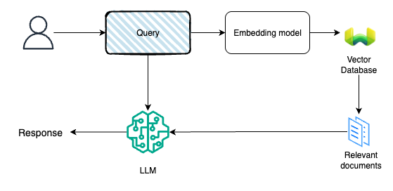
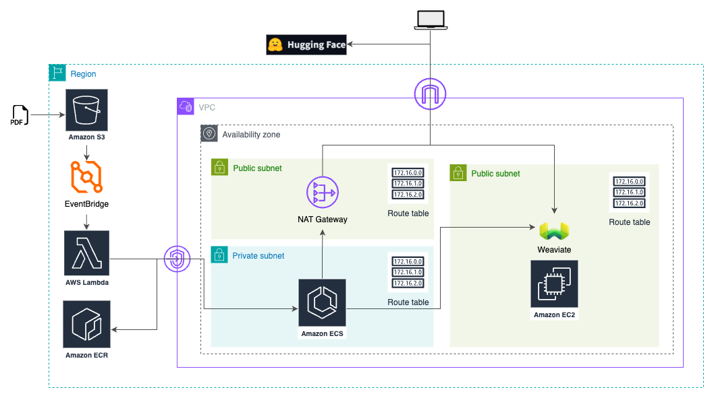
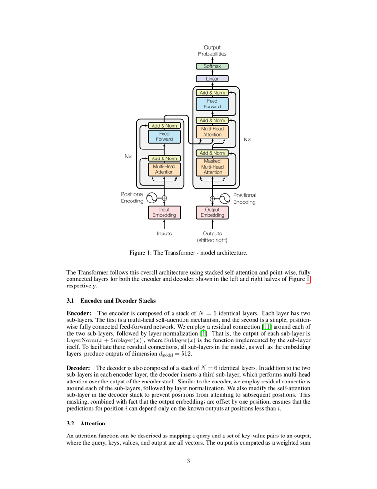
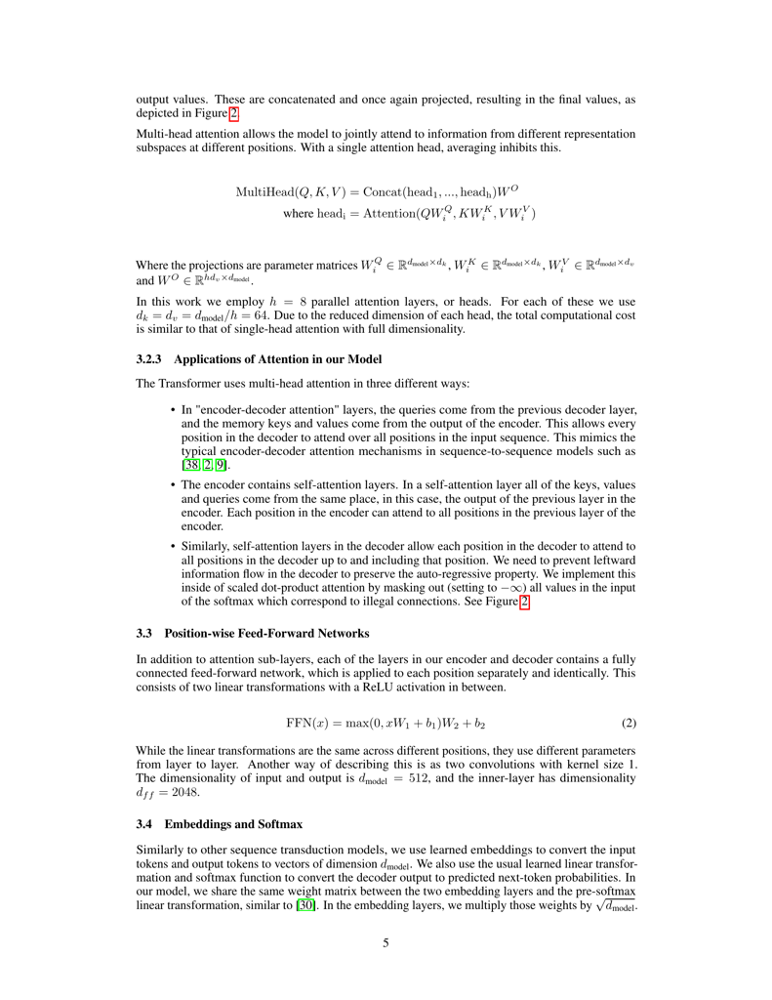
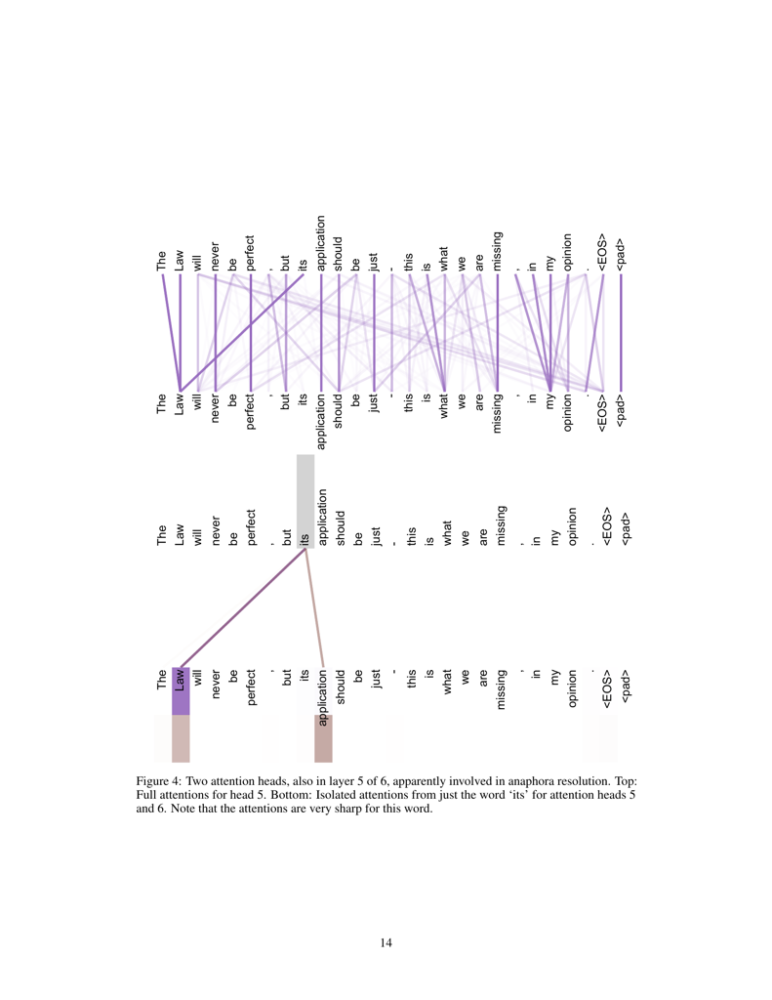
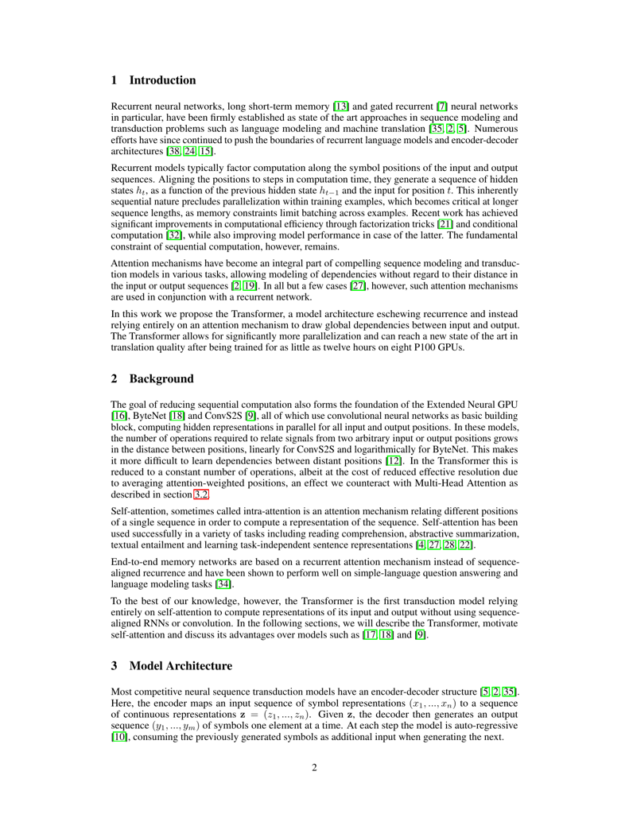

# Table of Contents
1. [Introduction](#introduction)
2. [Purpose and Use Case](#purpose-and-use-case)
3. [Architecture Diagram](#architecture-diagram)
4. [Project Structure](#project-structure)
5. [Retrieval Examples](#retrieval-examples)
6. [Lessons Learned and Points of improvement](#lessons-learned-and-points-of-improvement)

# Introduction
This project implements an automated and scalable document ingestion pipeline using AWS cloud services and state-of-the-art natural language processing. The system is designed to handle PDFs uploaded to an Amazon S3 bucket, process them through a series of orchestrated steps, and store vectorized representations of the content in a Weaviate vector database hosted on EC2.

## Key Workflow:
1. **PDF Upload to S3:** The pipeline is initiated when a user uploads a PDF file to a designated S3 bucket.

2. **Event-Driven Trigger with EventBridge:** An Amazon EventBridge rule listens for new object creation events in the S3 bucket and triggers an AWS Lambda function to begin processing.

3. **Lambda to ECS Task Orchestration:** The Lambda function acts as an orchestrator, launching an ECS task with the necessary parameters for downstream processing.

4. **ECS Task with ColQwen2 Model:** Within the ECS task, the following steps are performed:
    - Download the PDF from S3
    - Convert the PDF into individual images (one per page)
    - Extract semantic information from each page
    - Vectorize the content for semantic search and retrieval

5. **Vector Storage in Weaviate:** The vectorized outputs are then stored in a Weaviate instance running on EC2. This allows for efficient semantic search, retrieval, and analysis of the ingested documents.


# Purpose and Use Case
This architecture is designed to support Retrieval-Augmented Generation (RAG) for scalable and intelligent document processing. It enables advanced capabilities by combining semantic search with language model reasoning, particularly for:
- Context-aware question answering
- Semantic document retrieval and ranking
- Knowledge extraction from unstructured or semi-structured sources

At its core, the system processes a user query by embedding it using a vector representation model. The embedding is used to search a vector database for semantically relevant documents. These retrieved documents are then passed, along with the original user query, to a large language model (LLM) that synthesizes a contextually rich and accurate response.



# Architecture Diagram
The diagram depicts an event-driven architecture for automated document processing leveraging AWS services and a custom ECS task. When a PDF is uploaded to S3, it triggers a Lambda function via EventBridge. This Lambda then launches an ECS task that processes the document using the ColQwen2 model. To load the model, the ECS task accesses the Hugging Face Hub through a NAT gateway. After processing, the extracted content is vectorized and stored in a Weaviate database hosted on an EC2 instance, enabling semantic search and retrieval.




# Project Structure
The project is organized into three main folders, each responsible for a specific aspect of the overall system:

### 1. `terraform`
This folder contains all the Infrastructure as Code (IaC) using Terraform. It defines and provisions the necessary cloud resources such as S3 buckets, EventBridge rules, Lambda functions, ECS clusters, and networking components to support the document processing pipeline.

### 2. `weaviate`
This folder includes the `docker-compose.yaml` file which describes how to deploy the Weaviate vector database. It contains all configuration needed to launch and manage the Weaviate instance, enabling vector storage and semantic search capabilities.

### 3. `vector_pipeline`
This folder contains the core application code responsible for parsing PDF documents, vectorizing their content, and storing the vectors into the Weaviate database. It also includes a Jupyter notebook demonstrating how to query vectors and retrieve information.

Within `vector_pipeline`, the code is further modularized as follows:
- `parser`: Handles the extraction and transformation of PDF page images into vector representations.
- `vector_store`: Manages connections to the Weaviate database, handles vector insertion, and ensures collections are created if they don’t already exist.
- `util`: Provides shared utility functions used throughout the codebase, such as logging setup and configuration loading from YAML files.
- `retriever`: Implements a Qwen-based class designed to generate summaries from the PDF images retrieved from the vector store. Due to its computational intensity, the Jupyter notebook uses OpenAI’s GPT-4o model as a lightweight alternative for summarization and interpretation.


## Retrieval Examples
This section demonstrates how the RAG-based system retrieves relevant context from a vector database and uses it to enhance responses generated by ChatGPT-4o.

### Example 1: Relevant Query with Successful Retrieval

**🧑‍💻 User Query:**
> "What is the model architecture?"

In this example, the user asks a question directly related to the content of the "Attention Is All You Need" paper, which has been embedded and stored in the vector database.

- The query is processed and transformed into an embedding.
- The system retrieves the top 3 most relevant PDF pages from the document based on semantic similarity.
- These pages are then passed to ChatGPT-4o along with the original query as augmented context.

The model responds with a well-informed, context-aware answer that demonstrates strong comprehension of the document.

<table>
  <tr>
    <td></td>
    <td></td>
    <td></td>
  </tr>
</table>

```
ChatGPT-4o response:

The model architecture described is the Transformer, which consists of the following components:

### Encoder and Decoder Stacks

- **Encoder:**
  - Composed of a stack of \( N = 6 \) identical layers.
  - Each layer has two sub-layers:
    1. Multi-head self-attention mechanism.
    2. Position-wise fully connected feed-forward network.
  - Residual connections are employed around each sub-layer, followed by layer normalization.

- **Decoder:**
  - Also composed of a stack of \( N = 6 \) identical layers.
  - Each layer has three sub-layers:
    1. Multi-head self-attention mechanism.
    2. Multi-head attention over the encoder's output.
    3. Position-wise fully connected feed-forward network.
  - Similar use of residual connections and layer normalization.
  - Masked multi-head attention is used to prevent positions from attending to subsequent positions.

### Attention Mechanism

- **Multi-Head Attention:**
  - Allows the model to focus on different parts of the input sequence simultaneously.
  - Consists of \( h = 8 \) parallel attention layers (heads).
  - Uses scaled dot-product attention.

### Position-wise Feed-Forward Networks

- Each layer in the encoder and decoder contains a feed-forward network applied to each position separately.
- Consists of two linear transformations with a ReLU activation in between.

### Embeddings and Softmax

- Learned embeddings convert input tokens and output tokens to vectors of dimension \( d_{\text{model}} \).
- Shared weight matrix between the two embedding layers and the pre-softmax linear transformation.

### Additional Features

- **Positional Encoding:** Adds information about the position of tokens in the sequence.
- **Residual Dropout:** Applied to the output of each sub-layer and to the sums of the embeddings and the positional encodings.
- **Label Smoothing:** Used during training to improve accuracy and BLEU score.

This architecture enables efficient parallelization and improved performance in sequence transduction tasks like machine translation.
```

### Example 2: Irrelevant Query with Correctly Rejected Context

**🧑‍💻 User Query:**
> "How do attention-based strategies improve the outcome of negotiations in business models?"

In this case, the user asks a question unrelated to the content of the documents in the vector database. The system includes some images of PDF pages as additional context, but a system prompt is in place instructing the LLM to disregard irrelevant context and clearly communicate that to the user.

ChatGPT-4o correctly identifies the mismatch between the query and the provided context and responds by explaining that the images are not relevant to the question, maintaining accuracy and avoiding hallucination.

<table>
  <tr>
    <td></td>
    <td></td>
    <td></td>
  </tr>
</table>

```
ChatGPT-4o response:

The provided images are unrelated to your query about attention-based strategies in business models. However, I can provide a general answer based on my knowledge:

### Attention-Based Strategies in Business Negotiations

1. **Focus and Clarity:**
   - Attention-based strategies help negotiators maintain focus on key issues, ensuring that discussions remain relevant and productive.

2. **Active Listening:**
   - By paying close attention to the other party's words and body language, negotiators can better understand their needs and concerns, leading to more effective communication.

3. **Building Rapport:**
   - Demonstrating attentiveness can build trust and rapport, which are crucial for successful negotiations.

4. **Identifying Opportunities:**
   - Attention to detail allows negotiators to identify opportunities for compromise or mutual benefit that might otherwise be overlooked.

5. **Managing Emotions:**
   - Being attentive to emotional cues helps negotiators manage emotions, both their own and the other party's, to maintain a constructive atmosphere.

6. **Adapting Strategies:**
   - Attention-based strategies enable negotiators to adapt their approach based on real-time feedback and changing dynamics during negotiations.

By employing these strategies, negotiators can improve outcomes by fostering better understanding, cooperation, and agreement between parties.
```


## Lessons Learned and Points of improvement

### 1. GPU Intensive Workloads and ECS Deployment
Multimodal late interaction models like ColQwen2 are highly GPU intensive, which makes running them on AWS Fargate (which currently lacks GPU support) inefficient and slow. A significant improvement would be to run ECS tasks on GPU-enabled EC2 instances in the background to drastically reduce processing time and increase throughput.

### 2. Model Management and Docker Image Size
Since the ECS tasks operate within a private subnet without internet access, I initially pre-downloaded the models during Docker image build time to avoid runtime downloads from Hugging Face. This approach increased the Docker image size considerably. To optimize this, the image could be refactored into multiple Docker layers—separating model binaries from application code—allowing for better caching and more efficient image updates. In the short term, I introduced a NAT gateway to allow the ECS tasks to download models at runtime.

### 3. Weaviate Deployment in Public Subnet
Hosting the Weaviate database on an EC2 instance within a public subnet was a pragmatic decision due to time constraints. However, this exposes the database to potential security risks. Ideally, the instance should be placed in a private subnet with access controlled via a bastion host or AWS Systems Manager (SSM) Session Manager to ensure secure SSH connectivity and reduce the attack surface.

### 4. CI/CD Pipeline Implementation
The project would benefit greatly from implementing CI/CD pipelines to automate testing, building, and deployment processes. This would improve development velocity, reduce human error, and enable safer, more frequent updates.

### 5. Configuration Management with Ansible
Installing and managing Weaviate on EC2 manually is error-prone and time-consuming. Given more time, leveraging Ansible or a similar configuration management tool would allow for automated, repeatable, and scalable deployment, making infrastructure management more robust and maintainable.